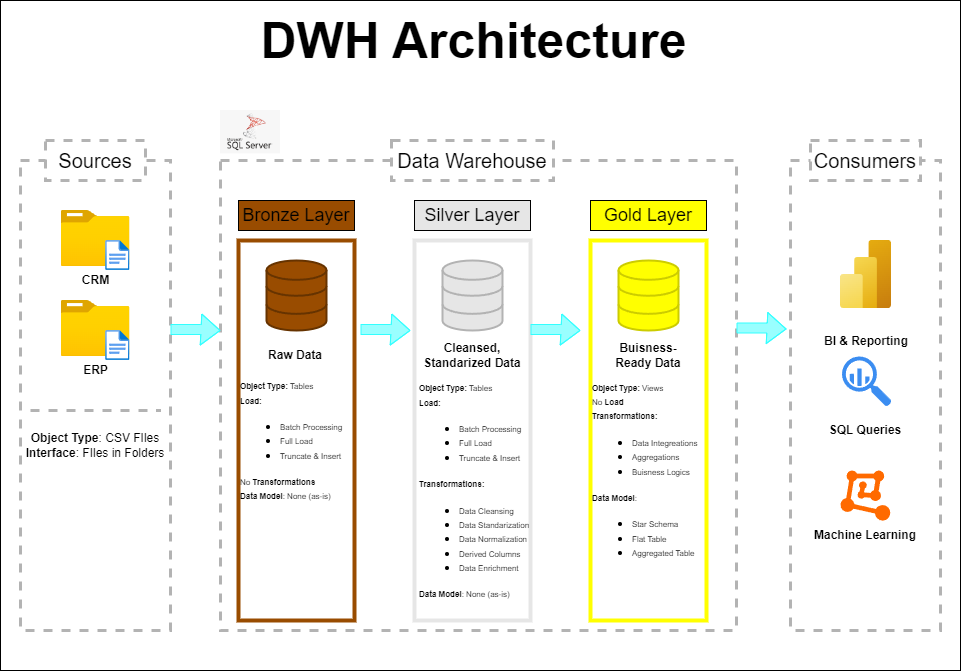

# SQL---DataWarehouse

Welcome to SQL---DataWarehouse Project repository!

This project includes comprehensive data warehousing and analytics solutions commonly used in the industry.

It was designed as a portfolio project.

Inspired by [DataWithBaraa](https://www.youtube.com/@DataWithBaraa).

## 📋 Table of Contents
 - <strong>Project Overview</strong>
 - <strong>Data Architecture</strong>
 - <strong>Project Requirements</strong>
 - <strong>Repository Structure</strong>
 - <strong>Tools used in the Project</strong>
 - <strong>About me</strong>

## 🔍 Project Overview

This project is divided into two parts.

First part showcases the process of building data warehouse, covering full road from raw CSV data files up to developing structured fact and dimension tables optimized for analytical queries.

 - <strong>Data Architecture</strong>: This data warehouse uses Medallion Architecture, containing three (Bronze, Silver, Gold) layers.
 - <strong>ETL process</strong>: Extracting, transforming and loading data from source into consecutive warehouse layers.
 - <strong>Data Modeling</strong>: Developing prepared for data analysis fact and dimension tables.

Second part demonstrates advanced techniques frequently used by professional data analytics and brings up final reports about customers and products in the business.
 - <strong>Analytics & Reporting</strong>: Creating SQL-based reports for actionable insights.

## 🏛️ Data Architecture

Project follows <strong>Medallion Architecture</strong> with <strong>Bronze</strong>, <strong>Silver</strong> and <strong>Gold</strong> layers: 

 - <strong>Bronze Layer</strong>: Stores raw data, as-is from source systems. Data is loaded from CSV files into the SQL Server Database with stored procedure. No transformations are performed.
 - <strong>Silver Layer</strong>: This layer includes data cleansing, standarization and normalization processes in order to prepare data for analysis. Data is loaded from Bronze layer into Silver layer with stored procedure. 
 - <strong>Gold Layer</strong>: Contains business-ready data modeled into star schema prepared for analysis. Data is stored in views.
 
## 📌 Project Requirements

## 🗂️ Repository Structure

## ⚒️ Tools used in the Project
 - [SQL Server Express](https://www.microsoft.com/en-us/sql-server/sql-server-downloads) - Lightweight server for hosting SQL database.
 - [SQL Server Management Studio (SSMS)](https://learn.microsoft.com/en-us/ssms/download-sql-server-management-studio-ssms?view=sql-server-ver16) - GUI for managing and interacting with database.
 - [Draw.io](https://www.drawio.com/) - Design data architecture, dataflows, models and diagrams.
 - [Notion](https://www.notion.com/) - For project management and organization.
 - [GitHub](https://github.com/) - Repository to manage version and collaborate on the code.

## 🙋 About me
